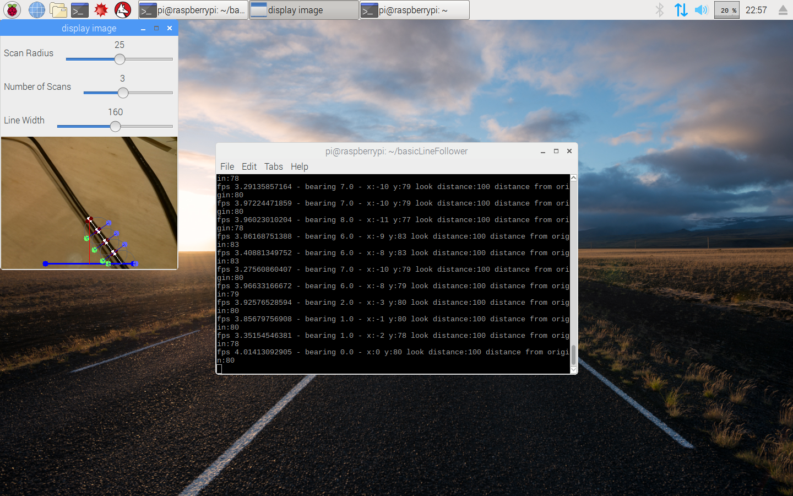

# Basic Line Follower

This is a python script does line tracking on a raspberry pi.

This code is based on [Robo Cup Junior 2014 entry](https://github.com/abaeyens/image-processing/) and uses: 
 * [picamera](https://picamera.readthedocs.io/en/release-1.13/)
 * [openCV](https://opencv-python-tutroals.readthedocs.io/en/latest)

